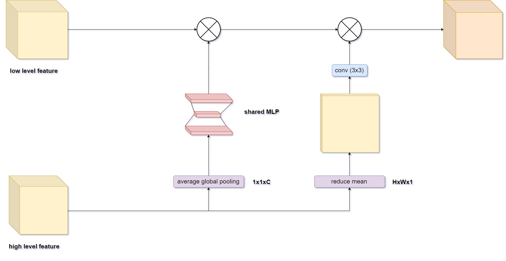
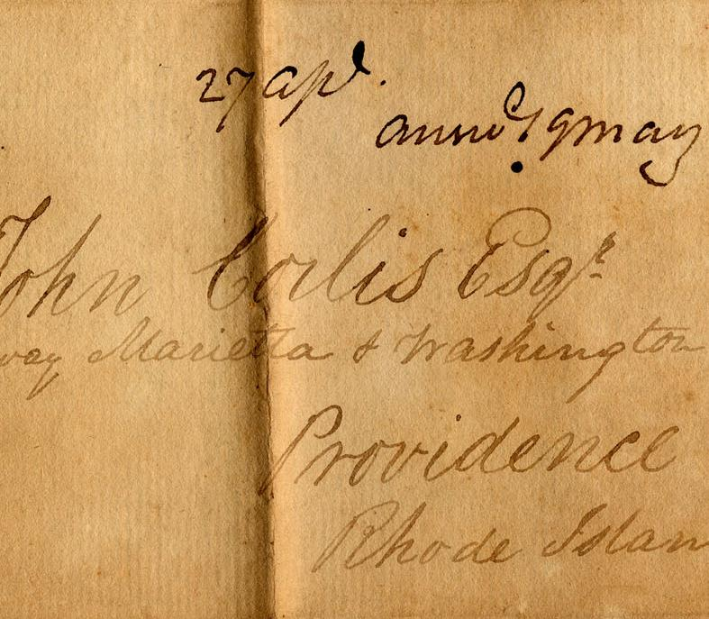
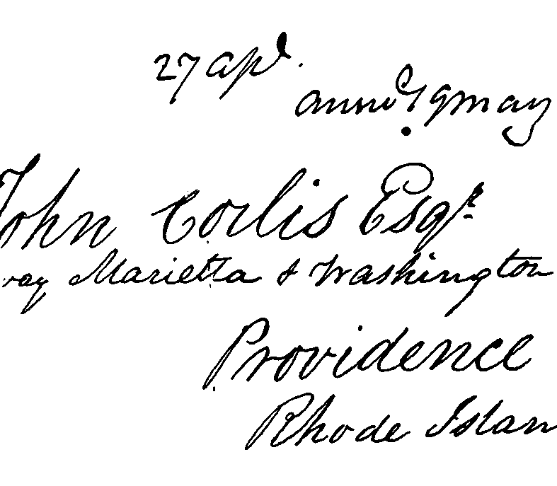
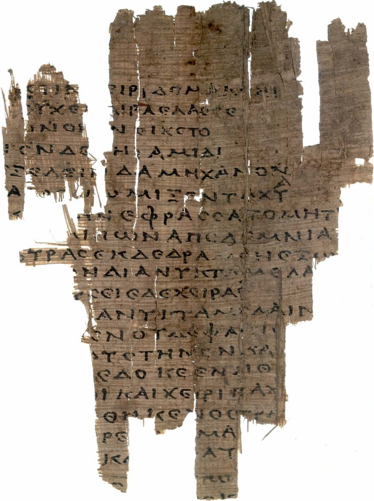
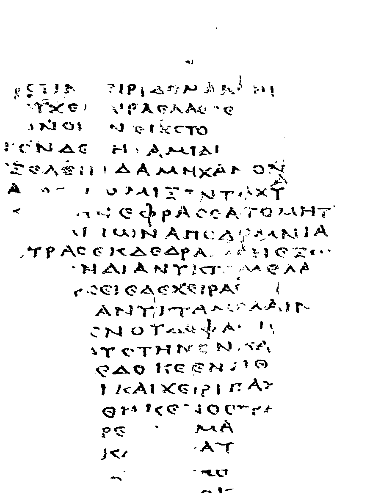

## Document Image Binarization using a Deep Learning Neural Network

Tensorflow implementation of a U-shape architecture based on U-net architecture. 
The model includes an attention mechanism inspired by CBAM attention mechanism

 

#### Examples 

  
   

  
   

### Reference:

https://arxiv.org/pdf/1807.06521.pdf

There is also the ability to use the SAGAN self-attention mechanism or not to use one.

### Reference:

https://arxiv.org/pdf/1805.08318.pdf

### Images Reference: 

I. Pratikakis, B. Gatos and K. Ntirogiannis, "ICDAR 2011 Document Image Binarization Contest (DIBCO 2011)," 2011 International Conference on Document Analysis and Recognition, Beijing, 2011, pp. 1506-1510, doi: 10.1109/ICDAR.2011.299.

I. Pratikakis, K. Zagoris, X. Karagiannis, L. Tsochatzidis, T. Mondal and I. Marthot-Santaniello, "ICDAR 2019 Competition on Document Image Binarization (DIBCO 2019)," 2019 International Conference on Document Analysis and Recognition (ICDAR), Sydney, Australia, 2019, pp. 1547-1556, doi: 10.1109/ICDAR.2019.00249.

### License

This project is licensed under the MIT License - see the LICENSE file for details

