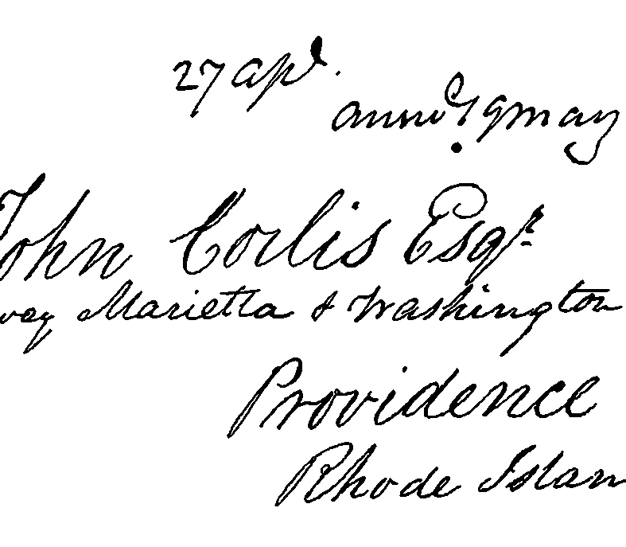
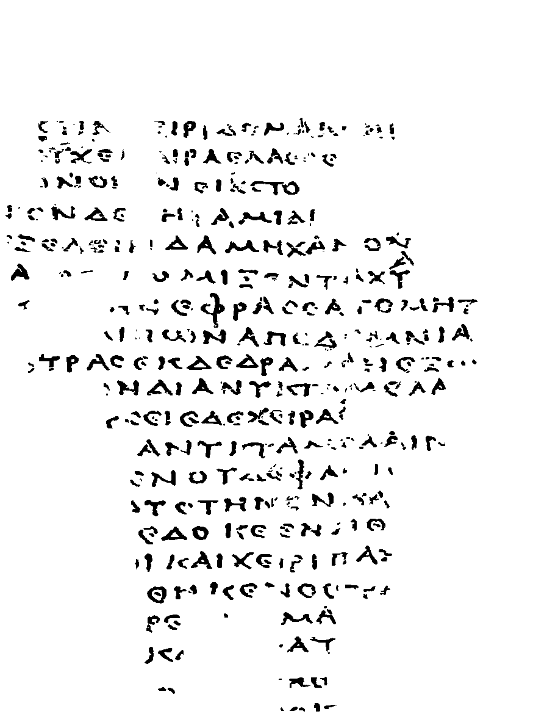

## Document Image Binarization using a Deep Learning Neural Network

Tensorflow implementation of a U-shape architecture based on U-net architecture. 
The model includes an attention mechanism inspired by 'CBAM' attention mechanism
#### Examples 

  
   

  
   

### Reference:

https://arxiv.org/pdf/1807.06521.pdf

There is also the ability to use the 'SAGAN' self-attention mechanism or not to use one.

### Reference:

https://arxiv.org/pdf/1805.08318.pdf

### License

This project is licensed under the MIT License - see the LICENSE file for details

